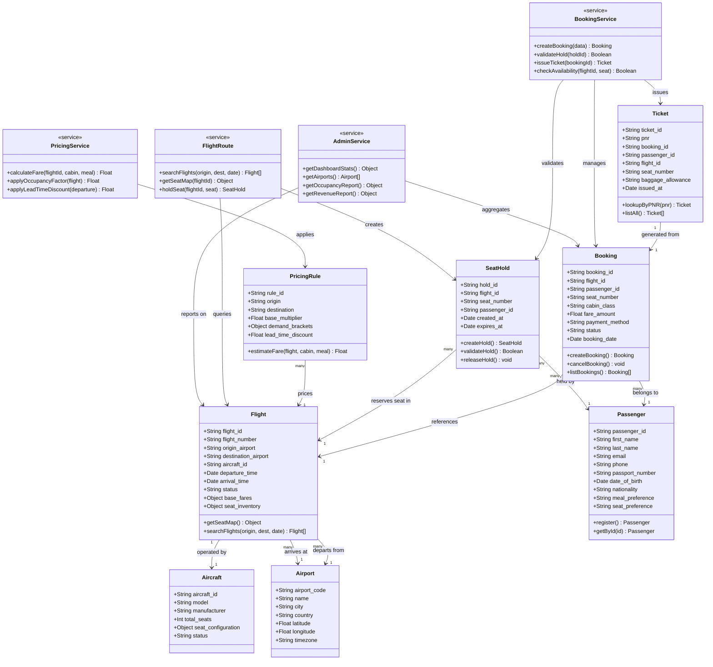

<div align="center">

<h1>✈️ SkyBookingSystem</h1>

<p><strong>Airline Reservation &amp; Dynamic Pricing System (ARDPS)</strong></p>

<p>
  
  
  
  
  
  
</p>

<p>
  
  
  
  
</p>

<p><em>A production-ready full-stack airline reservation platform featuring real-time seat management, dynamic pricing, concurrency control, and an integrated admin dashboard — all from a single Node.js server.</em></p>

</div>

---

## 📌 Table of Contents

- [Project Overview](#-project-overview)
- [Features](#-features)
- [Tech Stack](#-tech-stack)
- [System Architecture](#-system-architecture)
- [Class Diagram](#-class-diagram)
- [Project Structure](#-project-structure)
- [Database Schema](#-database-schema)
- [API Reference](#-api-reference)
- [Booking Flow](#-booking-flow)
- [Dynamic Pricing Logic](#-dynamic-pricing-logic)
- [Getting Started](#-getting-started)
- [Environment Variables](#-environment-variables)
- [Future Enhancements](#-future-enhancements)
- [Contributing](#-contributing)
- [Author](#-author)
- [License](#-license)

---

## 🧭 Project Overview

**SkyBookingSystem (ARDPS)** is a full-stack airline reservation platform built to demonstrate real-world software engineering concepts including REST API design, MongoDB schema validation, concurrency handling, and dynamic fare computation.

The system allows passengers to search flights, select seats from a live cabin map, hold seats for 10 minutes while completing checkout, and receive confirmed tickets with PNR codes — all protected against double-booking through server-side concurrency guards.

An integrated admin dashboard provides operational visibility into revenue, occupancy rates, booking status, and cancellations.

> **Highlights for Recruiters:** This project demonstrates full-stack JavaScript architecture, RESTful API design, MongoDB aggregation, real-time UI updates via polling, and server-side business logic including occupancy-based dynamic pricing.

---

## ✨ Features

| Feature | Description |
|---|---|
| 🔍 **Flight Search** | Search by origin, destination, and travel date with live results |
| 🪑 **Live Seat Map** | Visual cabin layout showing real-time seat availability |
| ⏳ **10-Minute Seat Hold** | Temporary reservation during checkout to prevent conflicts |
| 🔒 **Concurrency Control** | Server-side duplicate-booking prevention with atomic checks |
| 💲 **Dynamic Pricing** | Fares vary with occupancy, lead time, route rules, and meal preference |
| 👤 **Passenger Registry** | Create and manage passenger profiles with travel preferences |
| 📋 **Booking Records** | Full history of confirmed and cancelled reservations |
| 🎫 **PNR Ticket Lookup** | Search issued tickets by PNR or browse all tickets |
| 📊 **Admin Dashboard** | Revenue summaries, booking status, occupancy, and cancellations |
| 🌐 **Unified Server** | Frontend served directly by the Express backend — no separate web server needed |

---

## 🛠 Tech Stack

### Frontend
| Technology | Purpose |
|---|---|
| HTML5 | Semantic page structure |
| CSS3 | Styling and responsive layout |
| Vanilla JavaScript (ES6+) | DOM manipulation, Fetch API calls, UI state |
| Flatpickr | Date picker for flight search |

### Backend
| Technology | Purpose |
|---|---|
| Node.js | JavaScript runtime environment |
| Express.js | REST API framework and static file serving |
| CORS | Cross-origin resource sharing middleware |

### Database
| Technology | Purpose |
|---|---|
| MongoDB | NoSQL document database |
| Schema Validation | BSON type enforcement and field constraints |
| Indexes | Optimised queries on flights, PNRs, and seat holds |

---

## 🏗 System Architecture

```
┌─────────────────────────────────────────────────────────────┐
│                        CLIENT BROWSER                        │
│   index.html  ·  style.css  ·  app.js  ·  Flatpickr        │
└──────────────────────────┬──────────────────────────────────┘
                           │  HTTP / Fetch API
                           ▼
┌─────────────────────────────────────────────────────────────┐
│                   EXPRESS.JS SERVER (server.js)              │
│                                                              │
│  ┌──────────┐ ┌──────────┐ ┌──────────┐ ┌──────────────┐  │
│  │ /flights │ │/bookings │ │/passengers│ │   /tickets   │  │
│  └──────────┘ └──────────┘ └──────────┘ └──────────────┘  │
│  ┌──────────┐ ┌──────────┐                                  │
│  │ /pricing │ │  /admin  │                                  │
│  └──────────┘ └──────────┘                                  │
│                                                              │
│                    config/db.js                              │
└──────────────────────────┬──────────────────────────────────┘
                           │  MongoDB Driver
                           ▼
┌─────────────────────────────────────────────────────────────┐
│                        MONGODB                               │
│                                                              │
│  airports · aircraft · flights · passengers · bookings      │
│  pricing_rules · tickets · seat_holds                       │
└─────────────────────────────────────────────────────────────┘
```

---

## 📐 Class Diagram



---

## 📁 Project Structure

```
SkyBookingSystem/
│
├── 📄 README.md                  # Project documentation
├── 📄 collection_create.js       # MongoDB schema setup (validators + indexes)
├── 📄 insert_data.js             # Seed script for demo data
├── 📄 debug.js                   # Debug utility
│
├── 📂 backend/
│   ├── 📄 package.json           # Node.js dependencies and scripts
│   ├── 📄 server.js              # Express app entry point
│   │
│   ├── 📂 config/
│   │   └── 📄 db.js              # MongoDB connection management
│   │
│   └── 📂 routes/
│       ├── 📄 flights.js         # Flight search, seat map, seat holds
│       ├── 📄 bookings.js        # Booking creation and listing
│       ├── 📄 passengers.js      # Passenger registration and retrieval
│       ├── 📄 pricing.js         # Dynamic fare estimation
│       ├── 📄 tickets.js         # Ticket listing and PNR lookup
│       └── 📄 admin.js           # Admin stats and airport data
│
└── 📂 frontend/
    ├── 📄 index.html             # Single-page application shell
    ├── 📂 css/
    │   └── 📄 style.css          # Application styles
    └── 📂 js/
        └── 📄 app.js             # Client-side logic and API calls
```

---

## 🗃 Database Schema

### Collections Overview

| Collection | Description | Key Fields |
|---|---|---|
| `airports` | Airport master data | `airport_code`, `city`, `country`, coordinates |
| `aircraft` | Aircraft models and config | `aircraft_id`, `model`, `total_seats`, `seat_configuration` |
| `flights` | Schedules and inventory | `flight_number`, `origin`, `destination`, `base_fares`, `seat_inventory` |
| `passengers` | Passenger profiles | `passport_number`, `email`, `meal_preference`, `seat_preference` |
| `bookings` | Confirmed/cancelled reservations | `flight_id`, `passenger_id`, `seat_number`, `fare_amount`, `status` |
| `pricing_rules` | Dynamic pricing configuration | `origin`, `destination`, `demand_brackets`, `lead_time_discount` |
| `tickets` | Issued travel tickets | `pnr`, `booking_id`, `baggage_allowance`, `issued_at` |
| `seat_holds` | Temporary seat reservations | `flight_id`, `seat_number`, `expires_at` |

> All collections use **BSON schema validation** with typed fields and required-field enforcement. Indexes are applied on high-frequency query fields (PNR, flight ID, seat holds expiry) for optimal query performance.

---

## 🔌 API Reference

### Flights

| Method | Endpoint | Description |
|---|---|---|
| `GET` | `/api/flights` | List all flights |
| `GET` | `/api/flights/search?origin=&dest=&date=` | Search flights by route and date |
| `GET` | `/api/flights/:id` | Get flight details |
| `GET` | `/api/flights/:id/seats` | Get live seat map for a flight |
| `POST` | `/api/flights/:id/seats/hold` | Create a 10-minute temporary seat hold |

### Passengers

| Method | Endpoint | Description |
|---|---|---|
| `GET` | `/api/passengers` | List all passengers |
| `GET` | `/api/passengers/:id` | Get passenger by ID |
| `POST` | `/api/passengers` | Register a new passenger |

### Bookings

| Method | Endpoint | Description |
|---|---|---|
| `GET` | `/api/bookings` | List all bookings |
| `POST` | `/api/bookings` | Create a new confirmed booking |

### Tickets

| Method | Endpoint | Description |
|---|---|---|
| `GET` | `/api/tickets` | List all issued tickets |
| `GET` | `/api/tickets/:pnr` | Look up a ticket by PNR |

### Pricing & Admin

| Method | Endpoint | Description |
|---|---|---|
| `GET` | `/api/pricing` | Get dynamic fare estimates |
| `GET` | `/api/admin/stats` | Dashboard statistics |
| `GET` | `/api/admin/airports` | Airport list for UI dropdowns |

---

## 🔄 Booking Flow

```
User selects a flight
        │
        ▼
Frontend fetches live seat map
  GET /api/flights/:id/seats
        │
        ▼
User selects seat + preferences
        │
        ▼
App fetches dynamic fare estimate
  GET /api/pricing
        │
        ▼
App creates a 10-minute seat hold
  POST /api/flights/:id/seats/hold
        │
        ▼
Seat refreshes periodically (polling)
  GET /api/flights/:id/seats
        │
        ▼
User confirms booking
  POST /api/bookings
  ┌─────────────────────────────────┐
  │ Server validates:               │
  │  ✓ Hold is still active         │
  │  ✓ Seat is not double-booked    │
  │  ✓ Flight is still accepting    │
  └─────────────────────────────────┘
        │
        ▼
Booking confirmed → Ticket issued
        │
        ▼
UI shows PNR + confirmation
```

---

## 💰 Dynamic Pricing Logic

Fare computation is multi-factor and applied server-side:

| Factor | Impact |
|---|---|
| **Base Fare** | Set per route and cabin class in the flight document |
| **Occupancy Rate** | Higher occupancy → higher multiplier (demand-based pricing) |
| **Booking Lead Time** | Earlier bookings receive a discount; last-minute fares are elevated |
| **Route-specific Rules** | `pricing_rules` collection stores per-route demand brackets and multipliers |
| **Meal Preference** | Premium meal selections (e.g. special diet) add a surcharge |

---

## 🚀 Getting Started

### Prerequisites

- **Node.js** v16 or higher
- **MongoDB** v5+ running locally at `mongodb://localhost:27017`
- **mongosh** CLI (for seed scripts)

### Installation

```bash
# 1. Clone the repository
git clone https://github.com/VishnuVineeth14/SkyBookingSystem.git
cd SkyBookingSystem

# 2. Create collections with schema validation and indexes
mongosh < collection_create.js

# 3. Seed the database with demo data
mongosh < insert_data.js

# 4. Install backend dependencies
cd backend
npm install

# 5. Start the server
npm start
```

### Access the App

Open your browser and navigate to:

```
http://localhost:3000
```

> The Express server serves the frontend directly — no separate frontend dev server is needed.

---

## 🔧 Environment Variables

Create a `.env` file inside the `backend/` directory to override defaults:

| Variable | Default | Description |
|---|---|---|
| `MONGO_URI` | `mongodb://localhost:27017` | MongoDB connection string |
| `PORT` | `3000` | Express server port |
| `DB_NAME` | `airline_db` | Target database name |

---

## 🖥 UI Overview

| Page | Functionality |
|---|---|
| **Search** | Flight search form with origin, destination, and date filters |
| **Booking Modal** | Seat selector, passenger picker, cabin class, meal preference, payment method |
| **Passengers** | Register new passengers and browse existing records |
| **Bookings** | Full booking history with status indicators |
| **Tickets** | PNR search and ticket list with baggage details |
| **Admin** | Summary cards and charts for revenue, occupancy, and cancellations |

---

## 🔮 Future Enhancements

- [ ] JWT-based authentication and role management (Admin / Passenger)
- [ ] Email notifications for booking confirmation and cancellation
- [ ] Payment gateway integration (Stripe / Razorpay)
- [ ] Multi-city and round-trip booking support
- [ ] WebSocket-based real-time seat availability (replacing polling)
- [ ] Docker Compose setup for one-command deployment
- [ ] Unit and integration test suite (Jest + Supertest)
- [ ] CI/CD pipeline with GitHub Actions

---

## 🤝 Contributing

Contributions, issues, and feature requests are welcome!

```bash
# Fork the repo, then:
git checkout -b feature/your-feature-name
git commit -m "feat: add your feature"
git push origin feature/your-feature-name
# Open a Pull Request
```

Please follow conventional commit messages and ensure your code passes linting before opening a PR.

---

## 👨‍💻 Author

**Vishnu Vineeth**

[](https://github.com/VishnuVineeth14)

---

## 📄 License

This project is licensed under the **MIT License** — see the [LICENSE](LICENSE) file for details.

---

<div align="center">
  <sub>Built with ❤️ using Node.js, Express, and MongoDB</sub>
</div>
